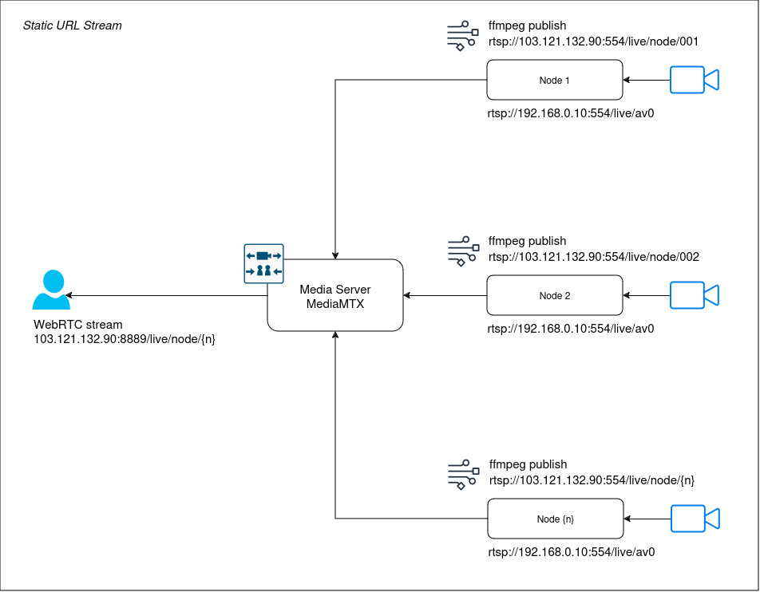
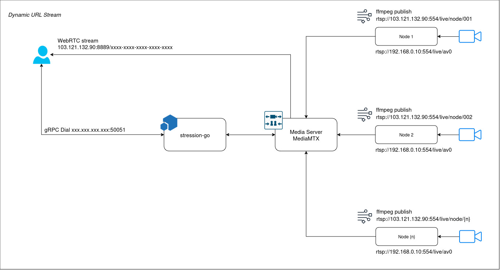

# Dynastream GO

Dynastream is a microservice (gRPC based API) which provides stream session with dynamic url. This project prevents client from accessing video stream directly.
<p align="left">
  
  
</p>

## Features

- Fully defined API contracts in `.proto` files.
- gRPC support for seamless communication.
- Scalable architecture with modular components.
- Easy integration with other services.


## Prerequisites

Before running the application, ensure the following are installed:

- Go (1.20 or newer)
```bash
  sudo apt install golang-go
```
- Protoc Buffer Compiler
```bash
  apt install -y protobuf-compiler
  protoc --version
```
- Go plugins for the protocol compiler. More info for installation: [gRPC](https://grpc.io/docs/languages/go/quickstart/)
```bash
  go install google.golang.org/protobuf/cmd/protoc-gen-go@latest
  go install google.golang.org/grpc/cmd/protoc-gen-go-grpc@latest
  export PATH="$PATH:$(go env GOPATH)/bin" # Update your PATH
```
- Make
```bash
  sudo apt install make
  make --version
```
- Redis. Please visit [Redis](https://redis.io/downloads/) or you can run via docker:
```bash
  docker run -d --name redis-stack-server -p 6379:6379 redis/redis-stack-server:latest
```
- Media server. Visit official github repository for [MediaMTX](https://bluenviron.github.io/mediamtx/)
- Media conversion and processing. Visit official website: [FFmpeg](https://www.ffmpeg.org/)


## Installation

- Clone Repository:
```bash
  git clone https://github.com/syauqisabili/dynastream-go.git
  cd dynastream-go
```
- Install dependencies:
```bash
  go mod tidy
```
- Start the application:
```bash
  make run
```
- Or you want to build:
```bash
  make build
```
- If you want to modify .proto files, regenerate the Go code using:
```bash
  make stream
```


    